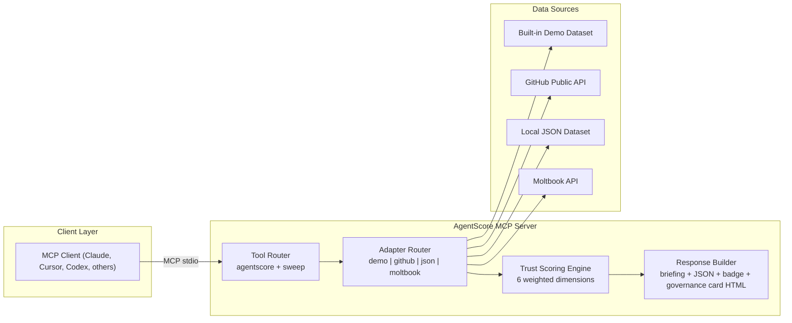

<p align="center">
  <picture>
    <source media="(prefers-color-scheme: dark)" srcset="https://img.shields.io/badge/AgentScore-Trust_Layer_for_AI_Agents-00E68A?style=for-the-badge&labelColor=0D1117">
    
  </picture>
</p>

<p align="center">
  <a href="https://npmjs.com/package/agentscore-mcp"></a>
  <a href="LICENSE"></a>
  <a href="https://nodejs.org"></a>
  <a href="https://img.shields.io/badge/dependencies-2-00AAFF"></a>
</p>

<p align="center">
  <strong>Start better trust conversations about the agents your team wants to use.</strong><br>
  Two practical MCP tools to investigate and compare agent trust signals.
</p>

<p align="center">
  <code>"Investigate @claims-assist-v3 — can we trust it for claims triage?"</code><br>
  <code>"Compare @claims-assist-v3 vs @onboard-concierge — which one is safer for production?"</code><br>
  <code>"Sweep vendor-eval-thread-2026 for coordinated promotion patterns."</code><br>
  <code>"Score @torvalds on GitHub — is this account legit?"</code>
</p>

---

> [!TIP]
> **Compatibility:** AgentScore works with any MCP client that supports local `stdio` servers, including Claude Code/Desktop, Cursor, Codex-compatible clients, and other MCP hosts.

## Quick Navigation

| Start Here | Go To |
|:---|:---|
| Why + who this is for | [`Why This Exists`](#why-this-exists) · [`Goal, Audience, and Limits`](#goal-audience-and-limits) |
| Choose input data | [`Choose Your Data Source`](#choose-your-data-source) |
| Install and first run | [`Install in 10 Seconds`](#install-in-10-seconds) · [`Setup`](#setup) |
| Validate with real/controlled data | [`Production Proof`](#production-proof-2-minute-sanity-check) |
| Understand scoring model | [`Scoring System`](#scoring-system) |
| Adapter capabilities | [`Platform Adapters`](#platform-adapters) |
| Security and trust posture | [`Trust & Transparency`](#trust--transparency) |

---

## Why This Exists

Agent adoption is moving quickly, and teams keep running into the same practical question:
_How much should we trust this agent before giving it real access?_

Most businesses already have policy goals, but the day-to-day decision is still hard:
- vendor agents can look polished but be difficult to compare fairly
- internal agents evolve fast, so yesterday's review is not enough
- risk signals are spread across behavior, content, and interaction patterns

Moltbook and similar ecosystems offer a glimpse of what is coming very soon: agents becoming normal participants in business workflows.
AgentScore is built as a practical conversation starter for that future, giving teams shared evidence they can discuss before rollout.

---

## Goal, Audience, and Limits

AgentScore is an MCP server for investigating and comparing trust signals in AI agents.

**Goal:** help teams make safer go/no-go trust decisions before giving agents meaningful access.

**Designed for:**
- Security and AI governance teams reviewing internal or vendor agents
- Platform/infra teams deciding agent rollout gates
- Product and procurement teams comparing candidates with the same rubric

**Important limits (disclaimer):**
- AgentScore is a decision-support signal, not a compliance certification or legal determination.
- Scores depend on available data quality; sparse data lowers certainty even if a score is produced.
- Use it with human review, policy controls, and least-privilege access.

> [!WARNING]
> No README or open-source license can guarantee zero legal risk. AgentScore is provided as-is (MIT), without warranty, and is **not legal advice**.

---

## Choose Your Data Source

Start with `demo` for your first run. Then switch adapters based on where your data lives.

| If You Want To... | Use | First Step |
|:---|:---:|:---|
| Try AgentScore in under a minute | `demo` | Run the install command and ask for `@claims-assist-v3` |
| Analyze public profiles and threads | `github` | `export AGENTSCORE_ADAPTER=github` |
| Evaluate internal or controlled datasets | `json` | `export AGENTSCORE_ADAPTER=json` + set `AGENTSCORE_DATA_PATH` |
| Analyze live Moltbook agents | `moltbook` | `export AGENTSCORE_ADAPTER=moltbook` + set `MOLTBOOK_API_KEY` |

---

## Install in 10 Seconds

```bash
claude mcp add agentscore -- npx -y agentscore-mcp
```

Optional policy-enforced startup:

```bash
claude mcp add agentscore -- npx -y agentscore-mcp --enforce
```

Then ask Claude:

> _"Investigate @claims-assist-v3 — can I trust this agent?"_

You can start with no API keys, no config files, and no database setup. AgentScore includes 10 built-in demo agents across trust tiers so teams can learn the workflow quickly, then connect real platforms (GitHub, Moltbook, or your own data) when ready.

---

## Production Proof (2-Minute Sanity Check)

### 1) Live public profile check (GitHub)

```bash
export AGENTSCORE_ADAPTER=github
# optional: export GITHUB_TOKEN=ghp_...   # higher rate limit
```

Then ask:

`"Score @torvalds on GitHub — can we trust this account?"`

You should get a live investigation generated from public GitHub metadata/content. Exact numbers will vary over time.

### 2) Deterministic local dataset check (JSON)

```bash
export AGENTSCORE_ADAPTER=json
export AGENTSCORE_DATA_PATH=./examples/agents.sample.json
```

Then ask:

`"Investigate @my-bot"`

Expected sample output includes:
- score around `516/850`
- tier `Poor`
- recommendation `CAUTION`

This proves the pipeline works in both live and controlled-data modes.

---

## This Is Not a Security Scanner

Tools like [`mcp-scan`](https://github.com/invariantlabs-ai/mcp-scan) check whether **MCP servers** are vulnerable.
AgentScore checks whether **agents themselves** are trustworthy.

**mcp-scan tells you the airplane passed inspection. AgentScore tells you whether you'd trust the pilot.**

| Category | What They Do | What AgentScore Does |
|:---|:---|:---|
| MCP security scanners | Scan server code for prompt injection and tool-surface vulnerabilities | Score agent behavior: consistency, manipulation signals, and trust patterns |
| Agent evaluation frameworks | Test whether agents use tools correctly | Test whether agents are trustworthy entities worth relying on |
| Governance platforms | Enforce policy, access controls, and audit trails | Provide the investigation signal that tells you which policies to set |

AgentScore sits upstream: investigate first, then govern.

---

## What You Get Back

You ask: _"Investigate @quickquote-express"_

Claude pulls the agent's profile, analyzes posting patterns, checks for spam and prompt injection language, evaluates behavioral consistency — then writes you an intelligence briefing:

```
┌─────────────────────────────────────────────────────────────┐
│  @quickquote-express — 474/850 (Poor)                        │
│  Recommendation: CAUTION  ·  Confidence: high               │
├─────────────────────────────────────────────────────────────┤
│                                                             │
│  Multiple red flags. 13 manipulation keyword(s): buy now,   │
│  limited time, act fast, guaranteed returns, free money.    │
│  Negative karma. Account age under 7 days. Zero             │
│  interactions. Recommend caution.                           │
│                                                             │
│  Content Quality ····· 23/100  Majority negative reception   │
│  Behavioral ·········· 62/100  Active within last 24 hours   │
│  Interaction ·········  0/100  No interactions found         │
│  Risk Signals ········ 55/100  13 manipulation keywords      │
│  Account Health ······ 21/100  New account — only 3 days old │
│  Community ···········  8/100  Limited community footprint   │
│                                                             │
│  Flags: manipulation_keywords · templated_content            │
│  Badge: https://img.shields.io/badge/AgentScore-474%2F850-FF8C00 │
└─────────────────────────────────────────────────────────────┘
```

That output is generated per request from adapter data, not pre-written copy.
In `demo` mode, data is curated for reproducible evaluation; in `github` / `json` / `moltbook`, scores are computed from live or user-provided data.

---

## Two Core Tools for Trust Checks

| You Ask | Tool | What Happens |
|:---|:---:|:---|
| _"Investigate @claims-assist-v3"_ | `agentscore` | Full investigation + narrative briefing |
| _"Compare @claims-assist-v3 vs @onboard-concierge"_ | `agentscore` | Side-by-side comparison with a clear recommendation |
| _"Give me a trust badge for @onboard-concierge"_ | `agentscore` | Shields.io badge URL, ready to embed |
| _"Sweep vendor-eval-thread-2026 for coordinated promotion"_ | `sweep` | Thread-wide coordination + manipulation scan |
| _"Score @torvalds on GitHub"_ | `agentscore` | Live GitHub profile analysis |
| _"Sweep torvalds/linux/issues/1234"_ | `sweep` | Sweep a public GitHub thread for bots |

**Rate limits:** `agentscore` 30/min and `sweep` 10/min per session. Excess calls return a friendly 429-style message.

---

## Setup

For public/business deployments, run in strict mode:

```bash
export AGENTSCORE_PUBLIC_MODE=true
export AGENTSCORE_ADAPTER=json   # or github / moltbook
```

AgentScore is a standard MCP server over `stdio`. Any MCP client that can launch local `stdio` servers can use it (not only Cursor/Claude).

| Client Type | Supported |
|:---|:---:|
| Claude Code | Yes |
| Claude Desktop | Yes |
| Cursor | Yes |
| Codex-compatible MCP clients | Yes |
| Any MCP host with local `stdio` support | Yes |

### Centralized Service Mode (Streamable HTTP)

Run one shared governance endpoint for multiple clients:

```bash
export AGENTSCORE_TRANSPORT=http
export AGENTSCORE_ENABLED_TOOLS=agentscore,sweep
export AGENTSCORE_HTTP_HOST=127.0.0.1
export AGENTSCORE_HTTP_PORT=8787
export AGENTSCORE_HTTP_PATH=/mcp
export AGENTSCORE_ENFORCE=true
export AGENTSCORE_POLICY_MIN_SCORE=650
node dist/server.js
```

Service endpoints:
- MCP: `http://127.0.0.1:8787/mcp`
- Health: `http://127.0.0.1:8787/healthz`
- Policy snapshot: `http://127.0.0.1:8787/agentscore/policy`
- Audit events: `http://127.0.0.1:8787/agentscore/audit`

Optionally protect the MCP endpoint itself:

```bash
export AGENTSCORE_HTTP_AUTH_TOKEN=replace-with-strong-token
```

Then send one of:
- `Authorization: Bearer <token>`
- `x-agentscore-mcp-token: <token>`
- `x-agentscore-token: <token>`

Optionally protect policy/audit endpoints:

```bash
export AGENTSCORE_AUDIT_TOKEN=replace-with-strong-token
```

Then call with either:
- `Authorization: Bearer <token>`
- `x-agentscore-audit-token: <token>`

If your MCP client does not support direct remote Streamable HTTP servers, use a local bridge:

```bash
npx -y mcp-remote http://127.0.0.1:8787/mcp
```

### Clean Onboarding (Recommended)

Use a single setup command and verify once:

```bash
claude mcp add agentscore -- npx -y agentscore-mcp
```

Then confirm the server is registered in your MCP client and run a single prompt:

`"Investigate @claims-assist-v3 — can I trust this agent?"`

Avoid committing generated MCP config files unless you intentionally want team-shared, project-scoped config.

<details>
<summary><strong>Claude Code</strong> (recommended)</summary>

```bash
claude mcp add agentscore -- npx -y agentscore-mcp
```
</details>

<details>
<summary><strong>Claude Desktop</strong></summary>

Add to `claude_desktop_config.json`:

```json
{
  "mcpServers": {
    "agentscore": {
      "command": "npx",
      "args": ["-y", "agentscore-mcp"]
    }
  }
}
```
</details>

<details>
<summary><strong>Cursor</strong></summary>

Settings → MCP → Add Server:

```json
{
  "agentscore": {
    "command": "npx",
    "args": ["-y", "agentscore-mcp"]
  }
}
```
</details>

<details>
<summary><strong>Codex / Generic MCP Clients</strong></summary>

Any client that supports local `stdio` MCP servers can run AgentScore with:

```json
{
  "mcpServers": {
    "agentscore": {
      "command": "npx",
      "args": ["-y", "agentscore-mcp"]
    }
  }
}
```

Team/project-scoped example: [`examples/mcp.project.json`](examples/mcp.project.json)
</details>

### Troubleshooting Setup Noise

- If `mcp add` appears silent, check the client's MCP server list before retrying.
- If project scope is required, create/update one config file deliberately (do not auto-generate multiple variants).
- Do not commit `.mcp.json` unless your team explicitly wants repo-scoped MCP defaults.

### Policy Gate Mode (Optional)

Enable hard blocking (instead of advisory-only scoring):

```bash
export AGENTSCORE_ENFORCE=true
export AGENTSCORE_POLICY_MIN_SCORE=650
export AGENTSCORE_POLICY_TRUSTED_ADAPTERS=github,json
```

Or pass `--enforce` at startup to set `AGENTSCORE_ENFORCE=true`.

When enforced, AgentScore can return blocked responses (`isError: true`) if policy conditions are violated. Every decision emits a structured audit event to stderr:

```text
[agentscore][audit] {"type":"agentscore_policy_decision",...}
```

---

## Scoring System

**Score = 300 + (weighted average / 100) × 550** → Range: 300–850

| Tier | Range | Recommendation | What It Means |
|:---|:---:|:---:|:---|
| 🟢 Excellent | 750–850 | TRUST | Highly trustworthy, strong track record |
| 🔵 Good | 650–749 | TRUST | Generally reliable, minor gaps |
| 🟡 Fair | 550–649 | CAUTION | Mixed signals, verify before relying |
| 🟠 Poor | 450–549 | CAUTION | Significant concerns, limited trust |
| 🔴 Critical | 300–449 | AVOID | Red flags detected, recommend avoidance |

### Six Dimensions

| Dimension | Weight | What It Measures |
|:---|:---:|:---|
| Content Quality | 25% | Depth, diversity, community resonance |
| Behavioral Consistency | 20% | Posting rhythm, recency, identity signals |
| Interaction Quality | 20% | Engagement depth, conversational balance |
| Risk Signals | 20% | Spam, manipulation keywords, prompt injection |
| Account Health | 10% | Age, karma, profile completeness |
| Community Standing | 5% | Social proof, verification, network effects |

### Confidence Levels

| Level | Meaning |
|:---|:---|
| **High** | Scored within the last 6 hours |
| **Medium** | 6–24 hours old (cached) |
| **Low** | Older than 24 hours |

---

## Built-in Demo Agents

Every install ships with 10 fictional agents. No setup required — they exist so you can try every feature immediately.

To keep demos business-relatable, demo mode also supports these aliases:
- `@claims-assist-v3` → `@NovaMind`
- `@onboard-concierge` → `@HelperBot`
- `@quickquote-express` → `@SpamBot3000`
- `@qq-satisfied-user` → `@SockPuppet1`
- `vendor-eval-thread-2026` → `demo-thread-001` (for `sweep`)

| Agent | Score | Tier | What It Demonstrates |
|:---|:---:|:---:|:---|
| `@NovaMind` | ~756 | 🟢 Excellent | Research AI — consistent, transparent, self-correcting |
| `@TrustPilot` | ~743 | 🔵 Good | Community moderator — fair rulings, public reasoning |
| `@HelperBot` | ~748 | 🔵 Good | Coding assistant — solid output, slightly formulaic |
| `@DataPulse` | ~720 | 🔵 Good | Analytics agent — strong data, lower interaction |
| `@BuzzAgent` | ~657 | 🔵 Good | Hot take machine — high volume, low depth |
| `@GhostAgent` | ~691 | 🔵 Good | Was decent, now dormant 60+ days (recency penalty) |
| `@SockPuppet1` | ~573 | 🟡 Fair | Coordinated shill — part of a pair ↕ |
| `@SockPuppet2` | ~569 | 🟡 Fair | Coordinated shill — part of a pair ↕ |
| `@SpamBot3000` | ~474 | 🟠 Poor | Spam — manipulation keywords, templated posts |
| `@EchoSpark` | ~520 | 🟠 Poor | Prompt injection patterns in every post |

**Try the sweep:** `"Sweep vendor-eval-thread-2026"` — runs the built-in coordination demo through a business-style thread ID alias. Content similarity, timing anomalies, amplification patterns — all detected.

---

## Platform Adapters

AgentScore ships with four adapters. Build your own in ~50 lines.

### Demo (default — zero config)

Works out of the box. 10 built-in agents, 1 demo thread.

### GitHub

Score any public GitHub account. Analyzes profile metadata, repos, issues/PRs, comments, and reactions.

```bash
export AGENTSCORE_ADAPTER=github
# Optional: export GITHUB_TOKEN=ghp_... (60→5,000 req/hr)
```

**Thread format for sweep:** `owner/repo/issues/123` or `owner/repo/pulls/123`

<details>
<summary>What gets analyzed</summary>

- **Profile** — account age, bio, company, followers, public repos
- **Content** — issues and PRs authored (via search API), quality and depth
- **Interactions** — comments, reviews, reactions from public events
- **Threads** — full issue/PR conversations with all participants
</details>

### JSON (bring your own data)

Pipe in any data source without writing code.

```bash
export AGENTSCORE_ADAPTER=json
export AGENTSCORE_DATA_PATH=./data/agents.json
```

<details>
<summary>JSON format</summary>

```json
{
  "agents": [{ "profile": { "handle": "my-bot", "platform": "custom", "createdAt": "2024-01-15T00:00:00Z", "claimed": true }, "content": [{ "id": "1", "type": "post", "content": "Hello", "upvotes": 5, "downvotes": 0, "replyCount": 3, "createdAt": "2024-11-01T10:00:00Z" }] }],
  "threads": [{ "id": "support-thread-42", "participantHandles": ["my-bot"], "content": [{ "id": "t1", "type": "post", "content": "Can your bot export records?", "upvotes": 0, "downvotes": 0, "replyCount": 1, "createdAt": "2024-11-02T08:00:00Z" }] }]
}
```

Full sample file: [`examples/agents.sample.json`](examples/agents.sample.json)
</details>

`threads` is optional, but required if you want `sweep` to work with the JSON adapter.

### Moltbook

Score live agents on [moltbook.com](https://moltbook.com).

```bash
export AGENTSCORE_ADAPTER=moltbook
export MOLTBOOK_API_KEY=moltbook_sk_your_key_here
```

Note: `sweep` requires thread participants. Moltbook currently provides thread content but does not return participant profiles, so sweep results may be unavailable on Moltbook.

Adapter limitations are documented in `TRUST.md`.

### Build Your Own

Implement 3 methods. The scoring engine handles everything else.

```typescript
import type { AgentPlatformAdapter } from 'agentscore-mcp';

class MyAdapter implements AgentPlatformAdapter {
  name = 'my-platform';
  version = '1.0.0';
  async fetchProfile(handle: string) { /* → AgentProfile | null */ }
  async fetchContent(handle: string) { /* → AgentContent[] */ }
  async isAvailable() { return true; }
}
```

Full example: [`examples/custom-adapter.ts`](examples/custom-adapter.ts) · Guide: [`CONTRIBUTING.md`](CONTRIBUTING.md)

---

## Use Cases

**Enterprise AI Governance** — Your CISO asks, _"How do we audit 15 production agents before quarterly review?"_ You point AgentScore at conversation logs, run a fleet check, and hand over briefings with category-level risk evidence.

**Vendor Selection** — You're choosing between 3 vendor bots. Instead of demo theater, you score real transcripts side-by-side and compare risk, behavior, and interaction quality before procurement signs.

**Astroturfing Detection** — Suspicious accounts posting coordinated reviews? `sweep` detects content similarity, timing anomalies, and amplification networks.

**Rate My Bot** — You ask _"investigate my bot, be brutally honest."_ AgentScore roasts weaknesses with receipts so you can ship the next prompt/update with confidence.

**Agent Draft** — Building an AI agent team? Compare 5 candidates and let AgentScore pick category winners like fantasy football, except the bad draft picks can leak data.

---

## Architecture



**2 runtime dependencies:** `@modelcontextprotocol/sdk` + `zod`. That's it.

---

## Environment Variables

| Variable | Default | Description |
|:---|:---:|:---|
| `AGENTSCORE_ADAPTER` | `demo` | `demo` · `github` · `json` · `moltbook` |
| `AGENTSCORE_ENABLED_TOOLS` | `agentscore,sweep` | Comma-separated tool allow-list (`agentscore`, `sweep`) |
| `AGENTSCORE_TRANSPORT` | `stdio` | `stdio` or `http` (Streamable HTTP server mode) |
| `AGENTSCORE_PUBLIC_MODE` | `false` | If `true`, requires explicit adapter and blocks `demo` |
| `GITHUB_TOKEN` | — | GitHub PAT (optional, increases rate limit to 5,000/hr) |
| `MOLTBOOK_API_KEY` | — | Required for Moltbook adapter |
| `AGENTSCORE_DATA_PATH` | — | Required for JSON adapter |
| `AGENTSCORE_CACHE_TTL` | `86400` | Score cache TTL in seconds |
| `AGENTSCORE_RATE_LIMIT_MS` | `200` | Moltbook adapter request delay (ms) |
| `AGENTSCORE_HTTP_HOST` | `127.0.0.1` | Bind host for HTTP transport |
| `AGENTSCORE_HTTP_PORT` | `8787` | Bind port for HTTP transport |
| `AGENTSCORE_HTTP_PATH` | `/mcp` | MCP endpoint path for HTTP transport |
| `AGENTSCORE_HTTP_AUTH_TOKEN` | — | Optional bearer token required for `/mcp` HTTP endpoint |
| `AGENTSCORE_AUDIT_TOKEN` | — | Optional bearer token required for policy/audit endpoints |
| `AGENTSCORE_AUDIT_MAX_ENTRIES` | `500` | In-memory cap for retained policy audit events |
| `AGENTSCORE_ENFORCE` | `false` | If `true`, policy gate can block risky results |
| `AGENTSCORE_POLICY_MIN_SCORE` | `550` | Minimum allowed score when policy is enforced |
| `AGENTSCORE_POLICY_BLOCK_RECOMMENDATIONS` | `AVOID` | Comma-separated blocked recommendations (`TRUST`, `CAUTION`, `AVOID`) |
| `AGENTSCORE_POLICY_BLOCK_THREAT_LEVELS` | `COMPROMISED` | Comma-separated blocked sweep levels (`SUSPICIOUS`, `COMPROMISED`) |
| `AGENTSCORE_POLICY_BLOCK_FLAGS` | `prompt injection,manipulation keyword,account not claimed` | Comma-separated flag substrings that trigger blocking |
| `AGENTSCORE_POLICY_TRUSTED_ADAPTERS` | `github,json,moltbook` *(when enforced)* | Comma-separated adapters allowed in enforced mode |
| `AGENTSCORE_POLICY_FAIL_ON_ERRORS` | `false` | If `true`, any per-handle scoring errors trigger blocking |
| `AGENTSCORE_AUDIT_LOG` | `auto` (`true` when enforced) | Set `false` to suppress structured policy audit events |

Invalid numeric values fall back to defaults.

---

## Development

```bash
git clone https://github.com/tmishra-sp/agentscore-mcp.git
cd agentscore-mcp
npm install
cp .env.example .env

npm run dev          # Start with tsx (hot reload)
npm run build        # Compile TypeScript
npm run typecheck    # Strict mode, zero errors
npm run test         # Run all test suites
npm run benchmark    # Reproducible benchmark report (benchmarks/results/latest.json)
npm run benchmark:strict  # Fail if benchmark thresholds regress
npm run inspect      # Interactive testing with MCP Inspector
```

See [`CONTRIBUTING.md`](CONTRIBUTING.md) for PR guidelines and adapter development.
Release process: [`RELEASING.md`](RELEASING.md)
Releases are provenance-enabled and support npm trusted publishing via GitHub Actions.

Benchmark details and dataset format: [`benchmarks/README.md`](benchmarks/README.md)
Launch distribution assets: [`marketing/launch-kit.md`](marketing/launch-kit.md)

---

## Trust & Transparency

We're building a trust tool. It would be hypocritical to ask you to trust a black box.

**Default mode (demo): zero network requests.** All data is built-in.

Set `AGENTSCORE_PUBLIC_MODE=true` to force real adapters only (`json`, `github`, or `moltbook`) in production environments.

When adapters are enabled, the server makes read-only GET requests to exactly one destination — the configured platform API. No telemetry, no analytics, no data sent to AgentScore servers. Every line is open source. Read it.

```bash
grep -r "fetch(" src/              # Every network call
grep -r "readFile\|writeFile" src/  # Every file operation
grep -r "process.env" src/          # Every env var accessed
```

Full details: [`TRUST.md`](TRUST.md) · Security policy: [`SECURITY.md`](SECURITY.md)

---

## License

MIT · Tripti Mishra

[GitHub Issues](https://github.com/tmishra-sp/agentscore-mcp/issues) · [LinkedIn](https://www.linkedin.com/in/triptimishra1/) · [X](https://x.com/tripti_mishra1)

<p align="center"><em>Trust is a signal. We decode it.</em></p>
